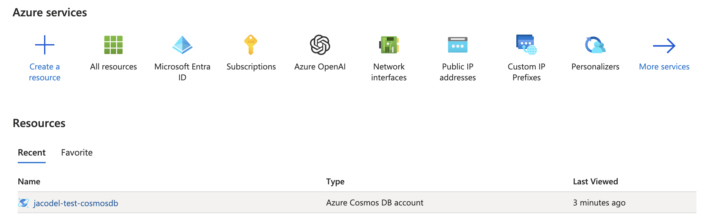
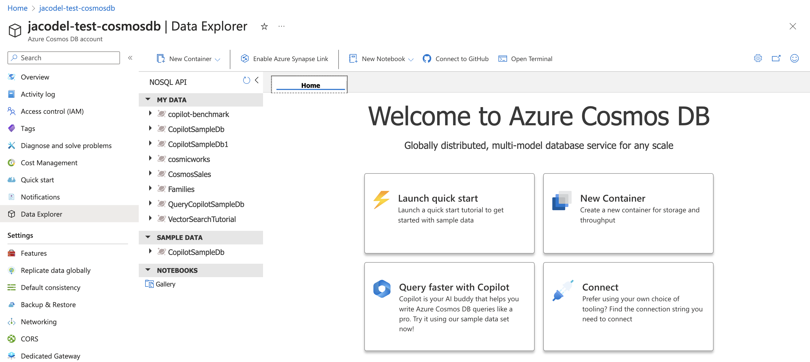
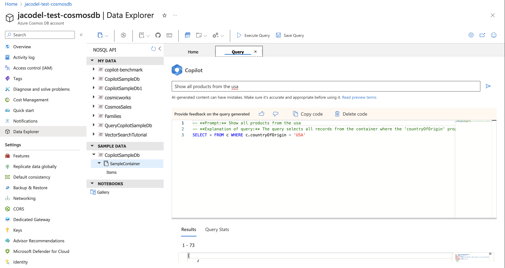
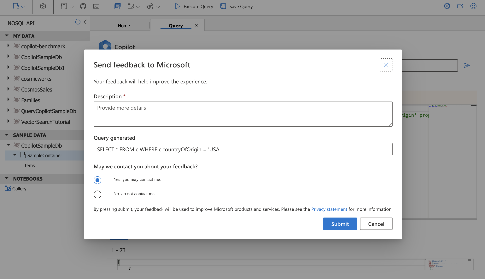

# Cosmos DB Query Copilot (Private Preview)

Azure Cosmos DB Query Copilot can help you write NoSQL queries faster and with less work by generating query suggestions based on the prompts you enter using natural text in English. With Azure Cosmos DB Query Copilot, you can:

* Ask questions about your data as you would in text or conversation to generate a Cosmos DB NoSQL query.
* Learn to write queries faster through detailed explanations of the generated query.

Cosmos DB Query Copilot is available to use in Azure Cosmos DB’s Data Explorer query editor in the Azure portal. During Private Preview, its use is limited to a sample dataset hosted that is provided at no cost.

**IMPORTANT**
Cosmos DB Query Copilot is a Private Preview feature that is powered by large language models (LLMs) and should only be used for informational purposes. Output produced by Query Copilot may contain inaccuracies, biases, or sensitive language. This is because the model powering Query Copilot was trained on information from the internet and other sources.

As with output from any generative AI model, the output produced by Query Copilot should be reviewed by a human before use. 

 

## How to enroll in the Cosmos DB Query Copilot Private Preview
If you have an Azure account, you can ask to join the wait list for the private preview of Cosmos DB Query Copilot by reaching out to: CosmosDBCopilot@microsoft.com.

## How to access Cosmos DB Query Copilot

1. Once you've been given access to the private preview of Cosmos DB Query Copilot, visit the [Azure portal](https://portal.azure.com/) and sign in using the same Azure credentials that you used to enroll in the private preview.

2. Select any Azure Cosmos DB NoSQL resource you have currently deployed. If you don't have an Azure CosmosDB NoSQL resource already, you can create one by following [these instructions](https://learn.microsoft.com/azure/cosmos-db/nosql/quickstart-portal).

     

3. Then, select _Data Explorer_ from the left-hand navigation pane.

     

4. Next, you can activate the Cosmos DB Query Copilot experience:
   1. Select  the "Query faster with Copilot" card on the _Data Explorer_ welcome screen. OR
   2. Select  the _CopilotSampleDb_ and _SampleContainer_ under the _SAMPLE DATA_ section, then select "New SQL Query" from the top menu bar, or the three dots (...) when hovering over _SampleContainer_

## How to use Cosmos DB Query Copilot

Once you have activated the Cosmos DB Query Copilot, you can generate NoSQL queries from natural language text on a sample data set containing some imaginary products and product reviews. To get started, try entering "Show all products from the usa" into the query prompt window. Selecting the right-facing arrow button will trigger Cosmos DB Query Copilot to generate a NoSQL query and explanation from the prompt.

     

You can then run the query by selecting the "Execute query" button from the Data Explorer's top menu bar, as you would normally.

## How to give feedback on Cosmos DB Query Copilot

We appreciate any feedback or comments you might have on the design, experience, or performance of Cosmos DB Query Copilot.

To send feedback on queries, use the "thumbs up" or "thumbs down" buttons above the query editor.

* If you select "thumbs up", we'll know that you liked or had a good experience generating a query from the prompt you entered. The "thumbs up" response, prompt you entered, and the generated query will be sent to Microsoft as a data point for where the Copilot has performed well.

* If you select thumbs down, a pop-up will appear asking for more information to send to Microsoft to describe the issue you experienced with the query. You can also provide a description of the issue, along with (optionally) giving Microsoft permission to follow-up with additional questions about your feedback via email. When you select the "Submit" button, your prompt, the Copilot generated query, and any text you entered will be sent to Microsoft to use for improving Cosmos DB Query Copilot. If you chose "Yes, you may contact me", your email address will also be sent to Microsoft for potential follow-up.

     

## How to write effective prompts

* When crafting prompts for Cosmos DB Query Copilot to convert natural language questions into NoSQL queries, be sure to start with a clear and concise description of the specific information you are looking for within the sample database.

    To get a good idea of what is contained in the sample database, run a `SELECT TOP 1 * FROM c` query to see the first document in the collection.

* Use keywords and context that are relevant to the Cosmos DB document structure to help Cosmos DB Query  Copilot generate accurate queries. Specify properties and any filtering criteria as explicitly as possible. Cosmos DB Query Copilot should be able to correct typos or understand context given the data in the sample schema.

* Avoid ambiguous or overly complex language in your prompts. Simplify the question while maintaining its clarity to ensure Cosmos DB Query Copilot can effectively translate it into a meaningful NoSQL query that retrieves the desired data from the collection.

* The following example prompts are clear, specific, and tailored to the schema and data within Cosmos DB, making it easier for Cosmos DB Query Copilot to generate accurate NoSQL queries.

  * Show me a product
  * Show all products that have the word "ultra" in the name or description
  * find the products from japan
  * Count all the products, group by each category
  * Show me all names and prices of products that have been reviewed by someone with a username that contains "mary"

## Frequently Asked Questions

### What can Cosmos DB Query Copilot do?

Cosmos DB Query Copilot can help you write NoSQL queries using a sample dataset with ease and confidence to boost your productivity through AI powered natural language to query generation.  

 

### What data was used to train the Cosmos DB Query Copilot?

Cosmos DB Query Copilot is powered by Large Language Models (LLMs) in Azure OpenAI that are pretrained, then configured to generate Azure Cosmos DB NoSQL queries and natural language explanations.

 

### What is Cosmos DB Query Copilot's intended use(s)?

You can generate Cosmos DB NoSQL queries from your own natural language questions and prompts within the Azure Cosmos DB Data Explorer. Each generated query is accompanied by a natural (English) language description of the query operations. In Private Preview, Cosmos DB Query Copilot is limited to a fixed sample dataset provided by Microsoft.

 

### How was Cosmos DB Query Copilot evaluated? What metrics are used to measure performance?

Cosmos DB Query Copilot is evaluated with test data and prompts on several metrics including:

* Validity: The query generated by Cosmos DB Query Copilot is a valid NoSQL query that can execute on the selected container.

* Correctness: The query generated by Cosmos DB Query Copilot is the query that would be expected to be generated in response to the user's prompt.

* Accuracy: The query generated by Cosmos DB Query Copilot returns the results that are relevant to and expected for the user’s prompt.

 

### What are the limitations of Cosmos DB Query Copilot?

Cosmos DB Query Copilot is a feature that helps users write NoSQL queries for Azure Cosmos DB by providing suggestions based on natural language input. However, it has some limitations that users should be aware of and try to minimize. Some of the limitations are:

* Rate limits: Cosmos DB Query Copilot limits how many queries a user can execute. If the user exceeds these limits, they'll receive an error message and have to wait until the next time window to use Query Copilot again.

* Usage limits: 
  * 5 calls/min/user
  * 30 calls/min/cosmos db account
  * 60 calls/min/subscription
  * total calls:
    * 500 calls/account/day
    * 1000 calls/sub/day

* Generates queries on sample data: Cosmos DB Query Copilot (Private Preview) is limited to run on a sample dataset provided by Microsoft. This means that the queries generated won't be applicable or optimal for the user’s own data and should be used for informational and educational purposes only. 
  
* The queries generated may not be accurate and provide the results the user intended to receive. Cosmos DB Query Copilot isn't a perfect system and may sometimes generate queries that are incorrect, incomplete, or irrelevant. This could happen due to various reasons, such as ambiguity in the natural language prompt, limitations of the underlying natural language processing and query generation models, or other issues. Users should always review the queries generated by Cosmos DB Query Copilot and verify that they match their expectations and requirements. Users should also provide feedback to the Query Copilot team if they encounter any errors or issues with the queries.  Users may submit feedback directly through Cosmos DB Query Copilot UI or send feedback to: CosmosDBCopilot@microsoft.com
  
* English-only support: Cosmos DB Query Copilot officially supports English as the input and output language. Users who want to use Query Copilot in other languages may experience degraded quality and accuracy of results.

 

### Does Cosmos DB Query Copilot write perfect queries?

In short, no. In our testing, we found that a significant proportion of queries can be executed without modification. However, any queries generated by Cosmos DB Query Copilot should be carefully reviewed, tested, and validated.

 

### How does a user get the most out of Cosmos DB Query Copilot?

Users can get the most out of their experience by following these steps:

* Input a prompt for AI to generate a query on the sample dataset: Users can type a natural language prompt in the Query Copilot box and select on the Generate button. Query Copilot will then generate a NoSQL query that matches the prompt and display it in the Query Editor with an explanation of the query.
  
* Modify the prompt to be more specific and regenerate the query: If the user isn't satisfied with the query generated by Query Copilot, they can select on the Regenerate button to ask the AI to generate a different query based on the refined prompt. 
    
* Send feedback via the thumbs up and thumbs down: Users can provide feedback to the Query Copilot team by clicking on the thumbs up or thumbs down icons next to the query. This feedback is used to improve the performance quality of Copilot responses. Learn more about [how we use your data](#where-can-i-learn-more-about-privacy-and-data-protection).

 

### What should I do if I see unexpected or offensive outputs?

Cosmos DB Query Copilot utilizes Azure OpenAI customized content filters to block offensive language in the prompts and to avoid synthesizing suggestions in sensitive contexts.  It's a feature that helps users write NoSQL queries for Azure Cosmos DB.  We continue to work on improving the filter system to detect and remove offensive outputs more intelligently. If you see offensive outputs, please report them using the “thumbs down” feedback button, or report them directly to: CosmosDBCopilot@microsoft.com so that we can improve our safeguards. Azure Cosmos DB takes this challenge seriously and we're committed to addressing it. [Learn more about Azure OpenAI content filters](https://learn.microsoft.com/azure/ai-services/openai/concepts/content-filter).

 

## Privacy

### What data does Cosmos DB Query Copilot collect?

* Cosmos DB Query Copilot relies on the database’s data schema and additional data to work. It collects data to provide the service, some of which is then retained for further analysis and product improvements. Cosmos DB Query Copilot processes the following data for individual users:

* User Engagement Data: When you use Cosmos DB Query Copilot it collects usage information about events generated when interacting with the Query Copilot in Data Explorer.  These events include user edit actions like if suggestions are accepted or dismissed, and error and general usage data to identify metrics like latency and features engagement. This information may include personal data, such as pseudonymous identifiers.

* Prompts: After receiving user input, Cosmos DB Query Copilot will construct complete prompt together with instructions, a few example queries, and then pass it to Azure OpenAI model.

* Suggestions: A Suggestion is one or more lines of proposed text returned to Cosmos DB Query Copilot after a Prompt is received and processed by the AI-model. The suggestions are transmitted in real-time only, we won’t retain the suggestions. 

* Feedback: We’ll collect and retain user feedback for analysis.

 

### How might Cosmos DB Query Copilot use the data it collects?

* User Engagement Data, Prompts, Suggestions and Feedback are used by Azure Cosmos DB to improve Cosmos DB Query Copilot and related services and to conduct product and academic research.

* Such uses may include:
  * Directly improving Cosmos DB Query Copilot, including assessing different strategies in processing and predicting which suggestions users may find helpful.
  * Investigating and detecting potential abuse of Cosmos DB Query Copilot.
  * Conducting experiments and research related to developers and their use of Azure Cosmos DB Data explorer and tools.
  * Evaluating Cosmos DB Query Copilot. For example, by measuring the positive impact it has on user experience.
  * Improving the underlying query generation models, for example, by providing positive and negative examples.
  * Adding new features to support additional query scenarios.
  * Reranking model outputs and prompt engineering.
  * When processing Prompts and Suggestions, Azure Cosmos DB takes the protection measures described in [how is the transmitted data protected?](#how-is-the-transmitted-prompt-and-query-data-protected), and follows responsible practices in accordance with our privacy statement so that the use of your data to improve these models doesn't result in this data being shared with other Cosmos DB Query Copilot users.

 

### How is the transmitted prompt and query data protected?

Cosmos DB Query Copilot takes several measures to protect data including:

* The transmitted data is encrypted both in transit and at rest; Copilot-related data is encrypted in transit using TLS, and at rest using Microsoft Azure’s data encryption (FIPS Publication 140-2 standards).

* Access is strictly controlled. The data is stored in separate AME subscription. The data can only be accessed by 1) Just-In-Time JIT approval by [SAW machines](https://learn.microsoft.com/azure/security/fundamentals/infrastructure-components).
* During Private Preview, data is stored securely in services located in the United States. Any user identifiable feedback Microsoft receives will be deidentified within 30 days and may be retained indefinitely and used to improve our products and services. 

 

### Will my private prompts or queries be shared with others to use?

* No. Prompts and queries won't be used as suggested for other users of Cosmos DB Query Copilot.

 

### Where can I learn more about privacy and data protection?

For more information on how Cosmos DB Query Copilot processes and uses personal data, please see the [Microsoft Privacy Statement](https://privacy.microsoft.com/privacystatement).
